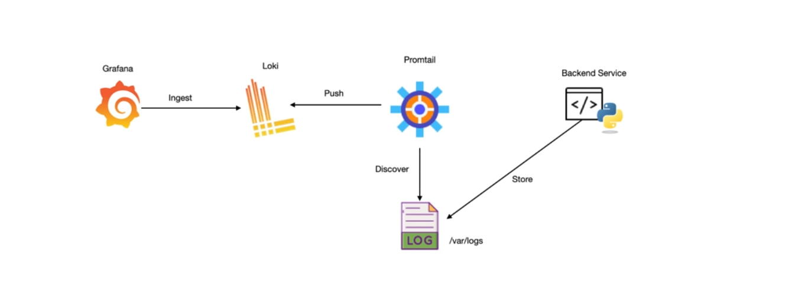
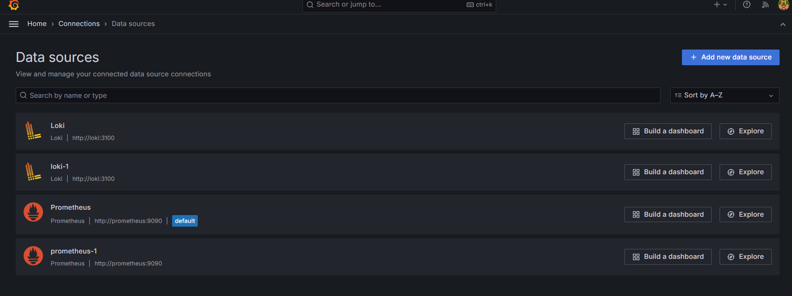
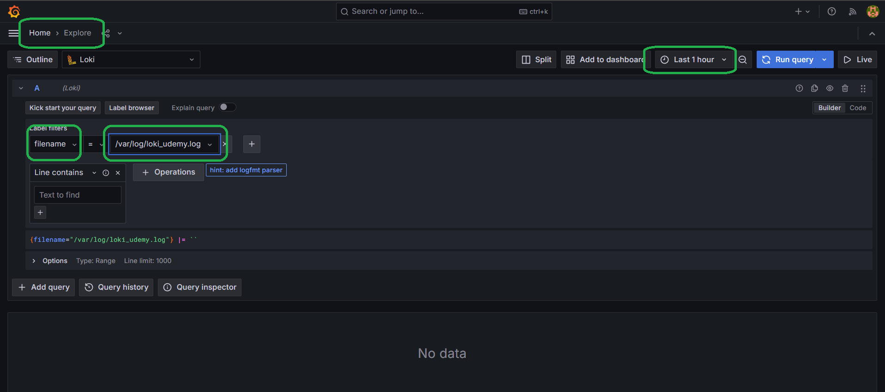

### Connect Loki to Grafana

#### How it works?


#### 1. Add data source connection to loki
```bash
http://localhost:3030/connections/datasources
```



#### 2. Go to Explore Logs data
```bash
http://localhost:3030/explore
```


#### 3. Generate some logs
```bash
make gen-logs
```
