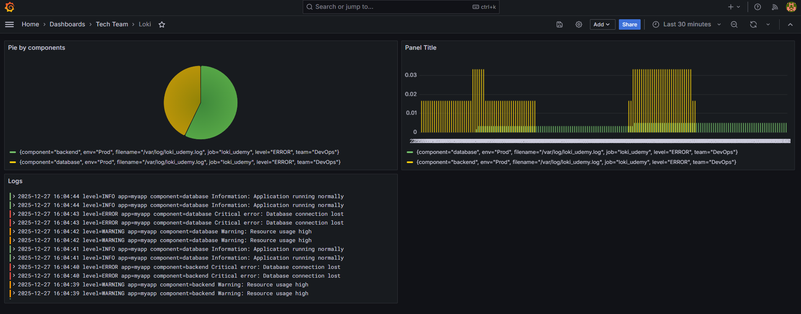

## 9-6. Creating and Attaching Static Labels
```bash
infra/promtail/promtail-config.yml
```
```bash
scrape_configs:
  - job_name: system
    static_configs:
      - targets:
          - localhost
        labels:
          job: varlogs
          __path__: /var/log/*log

  - job_name: loki_udemy
    static_configs:
      - targets:
          - localhost
        labels:
          job: loki_udemy
          __path__: /var/log/loki_udemy.log
          team: DevOps # Add this lines
          env: Prodbash # Add this lines
```
### than u can filter


## 9-7. Dynamic Labels Extracting
```bash
infra/promtail/promtail-config.yml
```
```bash
static_configs:
  - targets:
      - localhost
    labels:
      job: loki_udemy
      __path__: /var/log/loki_udemy.log
      team: DevOps
      env: Prod
pipeline_stages:
- logfmt: # парсит лог как key=value
    mapping:
      component: # вытаскивает поле component
- labels:
    component: # Теперь Promtail:
              # берёт extracted field component
              # превращает его в label Loki
              # ❗ Нельзя делать динамические лейблы с высокой кардинальностью
```
### than u can filter


## 9-8. Visualising Loki Queries on Dashboards
