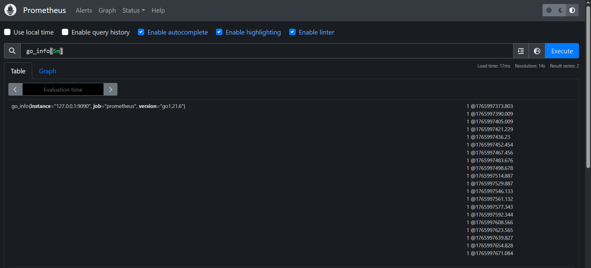

## 4-12. Data Types


## 4-13. Binary Arithmatic Operators

## 4-14. Binary Comparison Operators

## 4-15. Set Binary Operators

## 4-16. Matchers and Selectors
- **Selector**
```bash
http_requests_total
```

- **Selector with labels**
```bash
http_requests_total{job="api", method="GET"}
```

- **Empty Selector onyl labels**
```bash
{job="prometheus"}
```

- **Regex match .***
```bash
handler=~"/api/.*"
```

## 4-17. Aggregation Operators
- **Sum**
```bash
sum(node_cpu_seconds_total)
```

- **Sum by (key)** 
```bash
sum(node_cpu_seconds_total) by (mode)
```

- **Sum without (key)** 
```bash
sum(node_cpu_seconds_total) without (mode)
```

- **Group by (key)** 
```bash
group(node_cpu_seconds_total) by (mode)
```
```bash
avg(prometheus_http_requests_total) by (code)
```